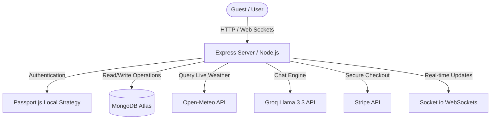

# Wanderlust (Airbnb Clone)
Wanderlust is a full-stack, Airbnb-inspired listing, booking, and review platform powered by **MongoDB, Express.js, React/EJS, and Node.js (MEN Stack)**. It features real-time socket updates, stripe payments, an AI travel assistant, and weather-guaranteed protection.

---

## 🛠️ System Architecture



### Key Architectural Layers:
1. **Frontend View Templates**: Built using server-side EJS (Embedded JavaScript) with `ejs-mate` layouts and Bootstrap for a fully responsive, device-friendly design.
2. **MVC Control Controllers**: Decoupled routes, database models, and logic components using Express Routers and controller modules.
3. **Real-time Synchronization**: Powered by **Socket.io** to synchronize booked dates instantly between users on listings details.
4. **AI & External Services**: Uses **Groq API** (Llama-3.3) for conversational assistant memory, and **Open-Meteo API** to query real-time weather forecasts.

---

## 🌟 Key Features

### 1. Listings & Reviews Management
- **CRUD Operations**: Authorized users can create, edit, view, and delete travel listings (including titles, descriptions, coordinates, price, and images hosted in Cloudinary).
- **Reviews & Ratings**: Review system with star rating widgets enabling users to add comments and rate stays.

### 2. Real-Time Booking & Stripe Payments
- **Date Picker & Lock System**: Implements a calendar date range selector using `flatpickr`. Once dates are chosen, they are temporarily locked (via Socket.io updates) to prevent double booking.
- **Stripe Checkout**: Generates custom Stripe payment sessions. Promos can be applied during payment (e.g., host-negotiated discounts).

### 3. WanderBot: AI Travel Assistant
- **Speech Recognition**: Voice-to-text integration using the Web Speech API. Talk directly to WanderBot!
- **Interactive Itineraries**: Requests for trip plans generate day-by-day itineraries rendered as interactive tabs in the chat.
- **Host Negotiation Simulation**: Bargaining with WanderBot on the listing page simulates host interaction, awarding promo codes (`WANDER10` or `WANDER15`).

### 4. 🌤️ Weather-Guaranteed Stay Protection
- **Live Forecast Integration**: Queries the Open-Meteo API using listing coordinates when dates are selected. If rain/storm is forecasted, WanderBot automatically prompts users to activate "Weather Protection".
- **Simulation Mode**: A developer toggle allows simulating bad weather.
- **Protection Actions**: Protected bookings experiencing bad weather show warning alerts in the dashboard allowing users to:
  1. **Claim 25% Refund/Discount Voucher**: Instantly awards a `WEATHER25` promo code.
  2. **One-click Reschedule**: Shift booking dates automatically by 2 weeks without cancellation fees.

---

## 📂 Folder Structure

```
project-root/
├── controllers/          # MVC Controller handlers (Listings, Bookings, Reviews, Chat)
├── models/               # MongoDB Mongoose schemas (User, Listing, Review, Booking)
├── public/               # Client-side static assets
│   ├── css/              # Stylesheets (style.css, chat.css, rating.css)
│   ├── js/               # JavaScript logic (chat.js, script.js)
│   └── sounds/           # Sound files for system audio
├── routes/               # Express routing layers
├── views/                # EJS template directories
│   ├── includes/         # Component partials (Navbar, Footer, Chat, Flash)
│   ├── layouts/          # EJS-mate boilerplate wrappers
│   └── listings/         # Listing views & payment dashboards
├── app.js                # Core Express application entry point
├── schema.js             # Joi schemas for server validation
└── README.md             # Project documentation
```

---

## 🚀 Environment Variables

Configure a `.env` file in the root directory:
```env
ATLASDB_URL=mongodb+srv://...
SECRET=your_session_secret
STRIPE_SECRET_KEY=sk_test_...
GROK_API_KEY=g-sdk_...
CLOUD_API_KEY=...
CLOUD_API_SECRET=...
CLOUD_NAME=...
```

---

## 👨‍💻 Contributing & Contact

Contributions are welcome! Please open a pull request or submit an issue.
- **Email**: ayanhakeem20@gmail.com
- **GitHub**: [ayan hakeem](https://github.com/ayanhakeem)
